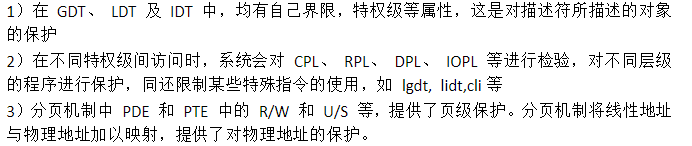
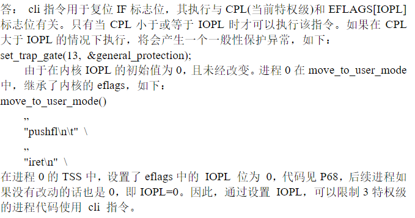
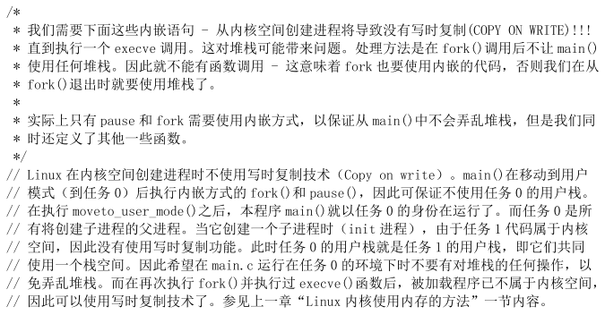
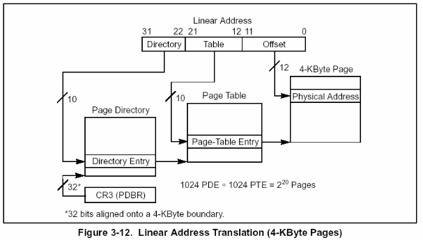

# 思考题

## 思考题1

1. **为什么计算机启动最开始的时候执行的是 BIOS 代码而不是操作系统自身的代码？**

   > 计算机启动的时候，内存尚未初始化， 因为 CPU 只能读取内存中的程序， 所以如果要首先执行操作系统的代码，那么需要先将操作系统的代码从硬盘加载到内存，但这一过程本身也需要执行指令，这些指令必定不能是操作系统的指令，而BIOS的作用之一正是提供这样的指令。

2. **为什么 BIOS 只加载了一个扇区，后续扇区却是由 `bootsect` 代码加载？为什么 BIOS 没有把所有需要加载的扇区都加载？**

   > 1. BIOS 和操作系统的开发通常是不同的团队，按固定的规则约定，可以进行灵活的各自设计相应的部分。
   > 2. BIOS 不知道需要加载的扇区有多少。
   > 3. 加载哪些扇区，将扇区加载到哪一般由操作系统决定。
   > 4. 给操作系统留尽量大的可用内存空间。
   > 5. BIOS 处于实模式，只能访问 1MB 以下的内存地址空间，如果操作系统需要加载的内容大于 1MB，它无法加载所有的内容。

3. **为什么 BIOS 把 `bootsect` 加载到 0x07c00，而不是 0x00000？加载后又马上挪到 0x90000 处，是何道理？为什么不一次加载到位？**

   > 1. 0x00000 是中断向量表的起始地址，暂时不能被覆盖。
   >
   > 2. 0x07c00 这个地址有历史原因。
   >
   >    0x7C00 这个地址来自 Intel 的第一代个人电脑芯片 8088，以后的 CPU 为了保持兼容，一直使用这个地址。1981 年 8 月，IBM 公司最早的个人电脑 IBM PC 5150 上市，就用了这个芯片。当时，搭配的操作系统是 86-DOS。这个操作系统需要的内存最少是 32KB。我们知道，内存地址从 0x0000 开始编号，32KB 的内存就是 0x0000～0x7FFF。8088 芯片本身需要占用 0x0000～0x03FF，用来保存各种中断处理程序的储存位置。(主引导记录本身就是中断信号 INT 19h 的处理程序。) 所以，内存只剩下 0x0400～0x7FFF 可以使用。为了把尽量多的连续内存留给操作系统，主引导记录就被放到了内存地址的尾部。由于一个扇区是 512 字节，主引导记录本身也会产生数据，需要另外留出 512 字节保存。所以，它的预留位置就变成了 0x7FFF - 512 - 512 + 1 = 0x7C00 
   >
   > 3. `bootsect` 有数据需要保存以便后续使用(比如：偏移 0x508 处保存的根文件系统所在的设备号)，而根据操作系统对内存的规划，内核占用 0x00000 开始的空间，因此 0x07c00 可能会被覆盖，并且 `system` 将会被加载到 0x10000-0x8FFFF 地址处，所以将 `bootsect` 挪到 0x90000 处。
   > 4. 《艺术》P6 点评
   > 5. 《艺术》P9 点评

4. **`bootsect`、`setup`、`head` 程序之间是怎么衔接的？给出代码证据。**

   > 1. `bootsect` 将 `setup` 加载到 0x90200 处
   >
   >    ```asm
   >    INITSEG  = 0x9000			! we move boot here - out of the way
   >    	
   >    	jmpi	go,INITSEG	! 修改 cs
   >    go:	mov	ax,cs
   >    	mov	ds,ax
   >    	mov	es,ax
   >    	
   >    load_setup:
   >    	mov	dx,#0x0000		! drive 0, head 0
   >    	mov	cx,#0x0002		! sector 2, track 0
   >    	mov	bx,#0x0200		! address = 512, in INITSEG
   >    	mov	ax,#0x0200+SETUPLEN	! service 2, nr of sectors
   >    	int	0x13			! read it
   >    	jnc	ok_load_setup		! ok - continue
   >    	mov	dx,#0x0000
   >    	mov	ax,#0x0000		! reset the diskette
   >    	int	0x13
   >    	j	load_setup
   >    ```
   >
   > 2. `bootsect` 将 `system` 加载到 0x10000 处
   >
   >    ```asm
   >    SYSSIZE = 0x3000
   >    SYSSEG   = 0x1000			! system loaded at 0x10000 (65536).
   >    ENDSEG   = SYSSEG + SYSSIZE		! where to stop loading
   >    
   >    	mov	ax,#SYSSEG
   >    	mov	es,ax		! segment of 0x010000
   >    	call	read_it
   >    	
   >    read_it:
   >    	mov ax,es
   >    	test ax,#0x0fff		! 64KB 对齐
   >    die:	jne die			! es must be at 64kB boundary
   >    	xor bx,bx		! bx is starting address within segment
   >    rp_read:
   >    	mov ax,es
   >    	cmp ax,#ENDSEG		! have we loaded all yet?
   >    	jb ok1_read
   >    	ret
   >    ok1_read:
   >    	seg cs
   >    	mov ax,sectors		! 每磁道扇区数
   >    	sub ax,sread		! 当前磁道已读扇区数
   >    	mov cx,ax
   >    	shl cx,#9			! 计算一共有多少个字节 (*512) 以下是用来判断是否超过 64KB，真正有用的是 ax
   >    	add cx,bx			! 段内当前偏移值
   >    	jnc ok2_read
   >    	je ok2_read			! 没有超过 64KB
   >    	xor ax,ax
   >    	sub ax,bx			! 计算此时最多能读入的字节数
   >    	shr ax,#9
   >    ok2_read:
   >    	call read_track
   >    	mov cx,ax			! 该次操作读取的扇区数
   >    	add ax,sread		! 当前磁道已读扇区数
   >    	seg cs
   >    	cmp ax,sectors		
   >    	jne ok3_read		! 如果当前磁道还有扇区未读，则跳转到 ok3_read
   >    	mov ax,#1
   >    	sub ax,head
   >    	jne ok4_read		! 如果是 0 磁头，则去读 1 磁头面上的扇区数据
   >    	inc track			! 否则去读下一磁道
   >    ok4_read:
   >    	mov head,ax
   >    	xor ax,ax			! 清零当前已读扇区数
   >    ok3_read:
   >    	mov sread,ax
   >    	shl cx,#9
   >    	add bx,cx			! 调整当前段内数据开始的位置
   >    	jnc rp_read
   >    	mov ax,es
   >    	add ax,#0x1000
   >    	mov es,ax
   >    	xor bx,bx
   >    	jmp rp_read
   >    	
   >    read_track:
   >    	push ax
   >    	push bx
   >    	push cx
   >    	push dx
   >    	mov dx,track	! 当前磁道号
   >    	mov cx,sread	! 当前磁道已读扇区数
   >    	inc cx			! 从下一扇区开始读
   >    	mov ch,dl
   >    	mov dx,head		! 当前磁头号
   >    	mov dh,dl
   >    	mov dl,#0
   >    	and dx,#0x0100
   >    	mov ah,#2
   >    	int 0x13
   >    	jc bad_rt
   >    	pop dx
   >    	pop cx
   >    	pop bx
   >    	pop ax
   >    	ret
   >    bad_rt:	mov ax,#0	! 执行驱动器复位操作
   >    	mov dx,#0
   >    	int 0x13
   >    	pop dx
   >    	pop cx
   >    	pop bx
   >    	pop ax
   >    	jmp read_track
   >    ```
   >
   > 3. `bootsect` 跳转到 `setup` 
   >
   >    ```asm
   >    SETUPSEG = 0x9020			! setup starts here
   >    	jmpi	0,SETUPSEG		! 跳转到 setup.s
   >    ```
   >
   > 4. `setup` 将 `system` 移动到 0x0 处
   >
   >    ```asm
   >    	mov	ax,#0x0000
   >    	cld			! 'direction'=0, movs moves forward
   >    do_move:
   >    	mov	es,ax		! destination segment
   >    	add	ax,#0x1000
   >    	cmp	ax,#0x9000
   >    	jz	end_move
   >    	mov	ds,ax		! source segment
   >    	sub	di,di
   >    	sub	si,si
   >    	mov 	cx,#0x8000
   >    	rep
   >    	movsw
   >    	jmp	do_move
   >    ```
   >
   > 5. `setup` 加载 GDT，令内核代码段基址指向第一条指令，即 0x0 处
   >
   >    ```asm
   >    ! 内核代码段
   >    	.word	0x07FF		! 8Mb - limit=2047 (2048*4096=8Mb)
   >    	.word	0x0000		! base address=0
   >    	.word	0x9A00		! code read/exec
   >    	.word	0x00C0		! granularity=4096, 386
   >    ```
   >
   > 6. `setup` 进入保护模式，通过内核代码段选择子和偏移量跳转到 `head`
   >
   >    ```asm
   >    jmpi	0,8		! jmp offset 0 of segment 8 (cs)		进入 head
   >    ```

5. **`setup` 程序里的 `cli` 是为了什么？**

   > 1. `setup` 要将内核代码复制到 0x00000 处，该处原本为中断向量表，内核代码覆盖该位置后中断向量表被破坏，如果此时有中断进来，中断不能被正确处理，因此在此之前需要关闭中断。
   > 2. 此时需要由 16 位实模式向 32 位保护模式转变，即将进行实模式下的中断向量表和保护模式下的中断描述符表的交接工作，在保护模式的中断机制尚未完成时不允许响应中断，以免发生未知的错误。

6. **`setup` 程序的最后是 `jmpi 0,8` 为什么这个 8 不能简单的当作阿拉伯数字8看待？**

   > 当进入保护模式后，`jmpi` 指令后若跟两个数字，则 CPU 将这两个数字视为偏移量和段选择子，根据段选择子的规则，bit15 - bit3 为描述符表的索引，bit2 表示在 GDT 中或在 LDT 中索引，bit1 - bit0 表示请求特权级。

7. **打开 A20 和打开 pe 究竟是什么关系，保护模式不就是 32 位的吗？为什么还要打开 A20？有必要吗？**

   > 打开 PE 表示让 CPU 进入保护模式，若不打开 A20，则对于所有 32 位地址，bit20 都为 0，可以访问的内存只能是奇数 1M 段。

8. **在 `setup` 程序里曾经设置过一次 `gdt`，为什么在 `head` 程序中将其废弃，又重新设置了一个？为什么折腾两次，而不是一次搞好？**

   > 1. 在 `setup` 程序里设置 `gdt` 是为程序进入保护模式提供全局描述符表；
   > 2. 在 `head` 程序中重新设置 `gdt` 的主要原因是为了把 `gdt` 表放在内存内核代码比较合理的地方。当然我们也可以在 `setup` 程序中就把描述符的段限长直接设置成 16MB，然后在 `head` 中直接把原 GDT 表移动到内存适当位置处。但由于 `setup` 和 `head` 连接时不在同一个文件，`setup` 无法直接获取 `head` 中的 gdt 的偏移量，需事先写入，这会使设计失去一般性，给程序编写带来很大不便。
   > 3.  《艺术》P33 点评

9. **Linux 是用 C 语言写的，为什么没有从 `main` 开始，而是先运行 3 个汇编程序，道理何在？**

   > 1. 有些操作只能用汇编来写，比如特权指令。
   > 2. 尽管可以用 gcc 将 C 语言编译为 16 位模式的代码，但生成的可执行文件为 ELF 格式的，除了执行指令外还有其他的部分，导致可执行文件的体积变大，可能 `bootsect` 可执行程序的大小大于一个扇区的大小，加载后造成运行错误。另外，BIOS 将第一扇区加载到内存后就从第一字节开始执行，因此需要进行裁剪，令第一条指令从第一字节开始。
   > 3. 使用汇编能在编译阶段就对内存按照自己的需求进行划分。比如 `setup.s` 中 IDT、GDT、页目录表、页表所占用的内存地址空间。
   > 4. 《艺术》P43 点评

10. **为什么不用 `call`，而是用 `ret` “调用” `main` 函数？画出调用路线图，给出代码证据。**

    > 1. 在逻辑上 `head` 是操作系统的底层，所以需要让 `main` 看起来是在调用 `head` 程序。
    > 2. 在由 `head` 程序向 `main` 函数跳转时，是不需要 `main` 函数返回的。
    >
    > 调用路线图：《艺术》P42 图 1-46
    >
    > ```mermaid
    > graph LR
    > 	id1(after_page_tables)--jmp-->id2(setup_paging)
    > 	id2--ret-->id3(main)
    > 	id3--ret-->id4(L6)
    > 	id4--jmp-->id4
    > ```
    >
    > 代码：
    >
    > ```asm
    > after_page_tables:
    > 	pushl $0		# These are the parameters to main :-)	envp
    > 	pushl $0		# argv
    > 	pushl $0		# argc
    > 	pushl $L6		# return address for main, if it decides to.
    > 	pushl $_main	# kernel 的 main 函数地址
    > 	jmp setup_paging
    > L6:
    > 	jmp L6			# main should never return here, but
    > 				# just in case, we know what happens.
    > 				
    > setup_paging:	// 内核分页，分完以后 线性地址 == 物理地址
    > 	// ...
    > 	ret			/* this also flushes prefetch-queue */		// 我们是操作系统的底层，所以要返回到 kernel 中
    > ```

11. **保护模式的“保护”体现在哪里？**

    > 1. 保护机制提供了对特定段或页进行限制性访问的能力。
    >
    >    
    >
    > 2. 当使用保护机制时，对内存的任何引用都要进行检验，以确定是否符合各种保护性要求，保护性检验可以分为以下几类：
    >    - 界限检验
    >    - 类型检验
    >    - 特权级检验
    >    - 可寻址区域的限制
    >    - 例程入口点的限制
    >    - 指令集的限制
    >
    > 3. 所有保护违例都会产生异常。

12. **特权级的目的和意义是什么？为什么特权级是基于段的？**

    > 除非某些可控制情况之外，处理器使用特权级来阻止较低特权级的进程或任务访问特权级较高的段。
    >
    > 特权级检验是在段描述符的段选择子被装入段寄存器时进行的。
    >
    > 

## 思考题2

1. **进程 0 的 `task_struct`、内核栈、用户栈在哪？证明进程 0 的用户栈就是未激活进程 0 时的 0 特权栈，即 `user_stack`，而进程 0 的内核栈并不是 `user_stack`，给出代码证据。**

   > 1. `task_struct` 位于全局静态变量 `init_task` 定义时的位置：
   >
   >    ```c
   >    static union task_union init_task = {INIT_TASK,};
   >    ```
   >
   > 2. 内核栈的栈底位于比 `task_struct` 地址高 4KB 的位置：
   >
   >    ```c
   >    union task_union {
   >    	struct task_struct task;	// 965B
   >    	char stack[PAGE_SIZE];		// 内核栈
   >    };
   >    ```
   >
   > 3. 用户栈位于全局变量 `user_stack` 定义的位置：
   >
   >    ```c
   >    long user_stack [ PAGE_SIZE>>2 ] ;
   >    ```
   >
   > 4. 在 `head.s` 中，定义 0 特权级的栈为 `stack_start`：
   >
   >    ```asm
   >    lss _stack_start,%esp
   >    ```
   >
   >    `stack_start` 定义如下：
   >
   >    ```c
   >    struct {
   >    	long * a;
   >    	short b;
   >    	} stack_start = { & user_stack [PAGE_SIZE>>2] , 0x10 };
   >    ```
   >
   >    因此 0 特权级的栈就是 `user_stack`，并且段选择子为 0x10，指向 GDT 表中的第 2 项，即内核数据段描述符，在 `head.s` 中定义如下：
   >
   >    ```asm
   >    .quad 0x00c0920000000fff
   >    ```
   >
   >    基址为 0x00000000，段界限为 16MB。
   >
   >    进程 0 进入用户态使用的 `ss` 为 0x17：
   >
   >    ```c
   >    #define move_to_user_mode() \
   >    __asm__ ("movl %%esp,%%eax\n\t" \
   >    	"pushl $0x17\n\t" /* ss  10111(ldt) */\
   >    	"pushl %%eax\n\t" /* esp user_stack 用户态也用这个栈 */\
   >    	"pushfl\n\t" /* eflags */\
   >    	"pushl $0x0f\n\t" /* cs 1111(ldt) */\
   >    	"pushl $1f\n\t" /* eip 以上手动压中断栈*/\
   >    	"iret\n" /* 从 0 特权跳转到 3 特权 */\
   >    	"1:\tmovl $0x17,%%eax\n\t" \
   >    	"movw %%ax,%%ds\n\t" \
   >    	"movw %%ax,%%es\n\t" \
   >    	"movw %%ax,%%fs\n\t" \
   >    	"movw %%ax,%%gs" \
   >    	:::"ax")
   >    ```
   >
   >    指向进程 0 LDT 表中的第 2 项，即用户数据段描述符，在 `sched.h` 的 `INIT_TASK` 宏中定义如下：
   >
   >    ```c
   >    {0x9f,0xc0f200}
   >    ```
   >
   >    基址为 0x00000000，段界限为 640KB，与进程 0 在 0 特权级下使用的栈段在 640KB 以内重合。同时进程 0 进入用户态使用的是内核态的栈顶指针偏移量 `esp`，由于基址相同，因此进程 0 进入用户态后 `esp` 指向的地址不变，还是 `user_stack` 表示的栈。
   >
   > 5. 进程 0 的内核栈定义在进程 0 `task_struct` 中的 `tss` 中，在 `INIT_TASK` 中定义如下：
   >
   >    ```c
   >    /*tss*/	{0,PAGE_SIZE+(long)&init_task,0x10,0,0,0,0,(long)&pg_dir,\
   >    	 0,0,0,0,0,0,0,0, \
   >    	 0,0,0x17,0x17,0x17,0x17,0x17,0x17, \
   >    	 _LDT(0),0x80000000, \
   >    		{} \
   >    	}, \
   >    ```
   >
   >    根据 `tss_struct` 结构体，`tss.esp0 = PAGE_SIZE+(long)&init_task`，`tss.ss0 = 0x10`，因此并不是 `user_stack`。

2. **在 `system.h` 里**

   ```c
   #define _set_gate(gate_addr,type,dpl,addr) \
   __asm__ ("movw %%dx,%%ax\n\t" \
       "movw %0,%%dx\n\t" \
       "movl %%eax,%1\n\t" \
       "movl %%edx,%2" \
       : \
       : "i" ((short) (0x8000+(dpl<<13)+(type<<8))), \
       "o" (*((char *) (gate_addr))), \
       "o" (*(4+(char *) (gate_addr))), \
       "d" ((char *) (addr)),"a" (0x00080000))
   
   #define set_intr_gate(n,addr) \
       _set_gate(&idt[n],14,0,addr)
   #define set_trap_gate(n,addr) \
       _set_gate(&idt[n],15,0,addr)
   #define set_system_gate(n,addr) \
       _set_gate(&idt[n],15,3,addr)
   ```

   **这里中断门、陷阱门、系统调用都是通过 `_set_gate` 设置的，用的是同一个嵌入汇编代码，比较明显的差别是 `dpl` 一个是 3，另外两个是 0，这是为什么？说明理由。**

   > 1. 门的特权检验规则为：CPL <= 调用门 DPL；RPL <= 调用门DPL
   > 2. 系统调用是由用户态程序调用的，因此 DPL 为 3.
   > 3. 以 `int` 指令主动发中断时使用中断门，以 `int3` 指令主动发中断时使用陷阱门，中断门和陷阱门不能被用户态程序调用，因此 DPL 为 0.

3. **进程 0 `fork` 进程 1 之前，为什么先要调用 `move_to_user_mode()`？用的是什么方法？解释其中的道理。**

   > 1. 使其进入用户态。`fork` 为系统调用，需要在用户态下调用。除进程 0 之外，所有进程都是由一个已有进程在用户态下完成创建的。
   > 3. 使用 `iret` 指令进入用户态，因为从内核态跳转到用户态只能使用 `iret` 指令，`iret` 为中断返回指令，执行该指令硬件会自动将 `eip`、`cs` 和 `eflags` 弹栈，如果需要切换特权级，还需要将 `esp`、`ss` 弹栈。因此在执行 `iret` 指令前需要将栈构造好，`ss` 和 `esp` 为进程 0 的用户栈段选择子和栈顶指针 `user_stack`，`cs` 和 `eip` 为进程 0 的用户代码段选择子和指令指针，指令指针指向从 `iret` 返回的下一条指令的地址。`cs` 和 `ss` 为进程 0  `ldt` 的选择子。
   
4. **在 IA-32 中，有大约 20 多个指令是只能在 0 特权级下使用，其他的指令，比如 `cli`，并没有这个约定。奇怪的是，在 Linux0.11 中，在 3 特权级的进程代码并不能使用 `cli` 指令，会报特权级错误，这是为什么？请解释并给出代码证据。**

   > 
   >
   > 在 3 特权级下执行 `cli` 指令会触发一般保护异常，中断号为 0x0d：
   >
   > ```asm
   > _general_protection:
   > 	pushl $_do_general_protection
   >  	jmp error_code
   > 
   > error_code:
   > 	// ...
   > 	iret
   > ```
   >
   > ```c
   > set_trap_gate(13,&general_protection);
   >      
   > void do_general_protection(long esp, long error_code)
   > {
   > 	die("general protection",esp,error_code);
   > }
   > ```
   >
   > 实验：
   >
   > 修改 `init/main.c` 中的代码为：
   >
   > ```c
   > 	move_to_user_mode();
   > 	__asm__ ("cli"::);
   > 	if (!fork()) {		/* we count on this going ok */
   > 		init();
   > 	}
   > ```
   >
   > 结果：
   >
   > 

5. **用户进程自己设计一套 LDT 表，并与 GDT 挂接，是否可行，为什么？**

   > 不可行。
   >
   > 1. 用户态无法访问 gdtr 的值，因此无法访问 GDT；
   > 2. GDT 位于内核数据段，属于 0 特权级，3 特权级的用户进程无权访问修改；
   > 3. LDT 的首地址的值必须使用 `lldt` 指令挂载到 ldtr 上才能被使用，但 `lldt` 指令是特权指令。

6. **分析初始化 IDT、GDT、LDT 的代码。**

   > 1. 初始化 IDT 的代码：
   >
   > ```gas
   > setup_idt:
   > 	lea ignore_int,%edx		# edx 保存中断描述符的高 32 位
   > 	movl $0x00080000,%eax	# eax 保存中断描述符的低 32 位
   > 	movw %dx,%ax		/* selector = 0x0008 = cs */
   > 	movw $0x8E00,%dx	/* interrupt gate - dpl=0, present */
   > 	# 以上构造中断描述符
   > 	lea _idt,%edi		# IDT 的基址
   > 	mov $256,%ecx
   > rp_sidt:
   > 	movl %eax,(%edi)
   > 	movl %edx,4(%edi)	# 填充 IDT 的内容
   > 	addl $8,%edi
   > 	dec %ecx
   > 	jne rp_sidt
   > 	lidt idt_descr		# 为 idtr 赋值
   > 	ret
   > 	
   > int_msg:
   > 	.asciz "Unknown interrupt\n\r"
   > .align 2
   > ignore_int:				# 默认中断处理程序
   > 	pushl %eax
   > 	pushl %ecx
   > 	pushl %edx
   > 	push %ds
   > 	push %es
   > 	push %fs
   > 	movl $0x10,%eax
   > 	mov %ax,%ds
   > 	mov %ax,%es
   > 	mov %ax,%fs
   > 	pushl $int_msg
   > 	call _printk		# 输出 "Unknown interrupt"
   > 	popl %eax
   > 	pop %fs
   > 	pop %es
   > 	pop %ds
   > 	popl %edx
   > 	popl %ecx
   > 	popl %eax
   > 	iret
   > 	
   > idt_descr:
   > 	.word 256*8-1		# idt contains 256 entries，IDT 的占用空间
   > 	.long _idt			# IDT 的基址
   > 
   > # IDT 的数据
   > _idt:	.fill 256,8,0		# idt is uninitialized
   > ```
   >
   > ```c
   > void trap_init(void)
   > {
   > 	int i;
   > 
   > 	set_trap_gate(0,&divide_error);		// 设置除操作出错的中断向量值，以下相同
   > 	set_trap_gate(1,&debug);
   > 	set_trap_gate(2,&nmi);
   > 	set_system_gate(3,&int3);	/* int3-5 can be called from all */
   > 	set_system_gate(4,&overflow);
   > 	set_system_gate(5,&bounds);
   > 	set_trap_gate(6,&invalid_op);
   > 	set_trap_gate(7,&device_not_available);
   > 	set_trap_gate(8,&double_fault);
   > 	set_trap_gate(9,&coprocessor_segment_overrun);
   > 	set_trap_gate(10,&invalid_TSS);
   > 	set_trap_gate(11,&segment_not_present);
   > 	set_trap_gate(12,&stack_segment);
   > 	set_trap_gate(13,&general_protection);
   > 	set_trap_gate(14,&page_fault);
   > 	set_trap_gate(15,&reserved);
   > 	set_trap_gate(16,&coprocessor_error);
   > 	for (i=17;i<48;i++)
   > 		set_trap_gate(i,&reserved);		// 保留
   > 	set_trap_gate(45,&irq13);		// 设置协处理器中断 0x2d(45) 陷阱门描述符，并允许其产生中断请求。设置并行口中断描述符
   > 	outb_p(inb_p(0x21)&0xfb,0x21);		// 允许 8259A 主芯片的 IRQ2 中断请求
   > 	outb(inb_p(0xA1)&0xdf,0xA1);		// 允许 8259A 主芯片的 IRQ13 中断请求
   > 	set_trap_gate(39,&parallel_interrupt);	// 设置并行口 1 的中断 0x27 陷阱门描述符
   > }
   > 
   > #define set_trap_gate(n,addr) \
   > 	_set_gate(&idt[n],15,0,addr)
   > 
   > #define _set_gate(gate_addr,type,dpl,addr) \
   > __asm__ ("movw %%dx,%%ax\n\t" \
   > 	"movw %0,%%dx\n\t" \
   > 	"movl %%eax,%1\n\t" /* 中断描述符的低 32 位 */\
   > 	"movl %%edx,%2" /* 中断描述符的高 32 位 */\
   > 	: \
   > 	: "i" ((short) (0x8000+(dpl<<13)+(type<<8))), /* bit32~bit47 */\
   > 	"o" (*((char *) (gate_addr))), \
   > 	"o" (*(4+(char *) (gate_addr))), \
   > 	"d" ((char *) (addr)),"a" (0x00080000))
   > ```
   >
   > 2. 初始化 GDT 的代码：
   >
   > ```asm
   > setup_gdt:
   > 	lgdt gdt_descr		# 为 gdtr 赋值
   > 	ret
   > 	
   > gdt_descr:
   > 	.word 256*8-1		# GDT 的占用空间
   > 	.long _gdt		# GDT 的基址
   > 	
   > # GDT 的数据
   > _gdt:	.quad 0x0000000000000000	/* NULL descriptor */
   > 	.quad 0x00c09a0000000fff	/* 内核代码段描述符 base=0 limit=16MB 可读 非一致性代码段 */
   > 	.quad 0x00c0920000000fff	/* 内核数据段描述符 base=0 limit=16MB 可写 */
   > 	.quad 0x0000000000000000	/* TEMPORARY - don't use */
   > 	.fill 252,8,0			/* space for LDT's and TSS's etc */
   > ```
   >
   > 3. 初始化 LDT 的代码：
   >
   > ```c
   > #define INIT_TASK \
   > /* ... */\
   > 	{ \
   > 		{0,0}, \
   > /* ldt */	{0x9f,0xc0fa00}, /* 用户态代码段 base=0 limit=640KB 可读 非一致性代码段 */\
   > 		{0x9f,0xc0f200}, /* 用户态数据段 base=0 limit=640KB 可写 */\
   > 	}, \
   > /* ... */\
   > }
   > 
   > // 在 GDT 中挂载 LDT 的描述符
   > #define set_ldt_desc(n,addr) _set_tssldt_desc(((char *) (n)),addr,"0x82")
   > 
   > #define _set_tssldt_desc(n,addr,type) \
   > __asm__ ("movw $104,%1\n\t" /* bit0~bit15 */\
   > 	"movw %%ax,%2\n\t" /* bit16~bit31 */\
   > 	"rorl $16,%%eax\n\t" /* 循环右移 */\
   > 	"movb %%al,%3\n\t" /* bit32~bit39 */\
   > 	"movb $" type ",%4\n\t" /* bit40~bit47 */\
   > 	"movb $0x00,%5\n\t" /* bit48~bit55 */\
   > 	"movb %%ah,%6\n\t" /* bit56~bit63 */\
   > 	"rorl $16,%%eax" \
   > 	::"a" (addr), "m" (*(n)), "m" (*(n+2)), "m" (*(n+4)), \
   > 	 "m" (*(n+5)), "m" (*(n+6)), "m" (*(n+7)) \
   > 	)
   > ```
   >

7. **在 `sched_init(void)` 函数中有这样的代码：**

   ```c
   for(i=1;i<NR_TASKS;i++) {
       task[i] = NULL;
       ……
   ```

   **但并未涉及task[0]，从后续代码能感觉到已经给了进程0，请给出代码证据。**

   > `task` 数组在定义时就已经初始化了 `task[0]`：
   >
   > ```c
   > struct task_struct * task[NR_TASKS] = {&(init_task.task), };
   > ```

## 思考题3

1. **进程 0 `fork` 进程 1 之前，为什么先调用 `move_to_user_mode()`？用的是什么方法？解释其中的道理。**

2. **为什么 `static inline _syscall0(type,name)` 中加上关键字 inline？**

   > 
   >
   > 1. `fork` 之后内核会通过将子进程放在队列的前面，以让子进程先执行，以免父进程执行导致写时复制，而后子进程执行 `exec` 系统调用，因无意义的复制而造成效率的下降。
   >
   > 2. 每个进程都有自己的内核空间，不会造成 COW，而在 `fork.c` 中调用 `copy_page_tables` 只是对用户数据段进行复制，因此主要就是防止进程 0 使用用户数据段造成 COW。
   >
   >    ```c
   >    int copy_mem(int nr,struct task_struct * p)		// 做线性和物理内存
   >    {
   >    	// ...
   >    	old_data_base = get_base(current->ldt[2]);
   >    	// ...
   >    	new_data_base = new_code_base = nr * 0x4000000;		// nr * 64MB(4GB / 64)
   >    	// ...
   >    	if (copy_page_tables(old_data_base,new_data_base,data_limit)) {		// 为子进程复制父进程页表内容
   >    		free_page_tables(new_data_base,data_limit);
   >    		return -ENOMEM;
   >    	}
   >    	return 0;
   >    }
   >    ```

3. **`copy_process` 函数的参数最后五项是：`long eip,long cs,long eflags,long esp,long ss`。查看栈结构确实有这五个参数，奇怪的是其他参数的压栈代码都能找得到，却找不到这五个参数的压栈代码，反汇编代码中也查不到，请解释原因。**

   > `copy_process` 函数是由系统调用来调用的，系统调用是用 `int 0x80` 中断实现的，当发生中断时，如果需要进行特权级转换，则硬件自动将 `ss` 和 `esp` 压栈，然后将 `eflags`、`cs` 和 `eip` 压栈。

4. **打开保护模式、分页后，线性地址到物理地址是如何转换的？**

   > 1. cpu 通过 cr3 寄存器定位到页目录表的物理地址；
   > 2. 使用线性地址的高 10 位作为索引在页目录表中定位到某一页目录表项；
   > 3. 读出页目录表项的内容，即为页表的物理地址；
   > 4. 使用线性地址的中间 10 位作为索引在页表中定位到某一页表项；
   > 5. 读出页表项的内容，即为对应的页的起始物理地址；
   > 6. 页的起始物理地址加上线性地址的低 12 位即为线性地址对应的物理地址。
   >
   > 

5. **分析 `get_free_page()` 函数的代码，叙述在主内存中获取一个空闲页的技术路线。**

   > 在 `mem_map` 中从后向前找出引用计数为 0 的第一项，将该项的引用计数置为 1，并通过下标计算空闲页的起始物理地址(`LOW_MEM+(index<<12)`)，从高地址向低地址用 0 填充该页，最后返回该页的起始物理地址。如果所有的引用计数都不为 0，即没有空闲页，则返回 0.

6. **分析 `copy_page_tables()` 函数的代码，叙述父进程如何为子进程复制页表。**

   > 1. 要求源地址和目的地址必须按 4MB 对齐；
   > 2. 计算源地址和目的地址所在的页目录表项的线性地址；
   > 3. 通过所占的地址空间计算所用的页目录表项数；
   > 4. 根据页目录表项的起始线性地址和页目录表项数遍历页目录表，对每一个源页目录表项，如果对应的页表存在，则进行以下操作：
   >    1. 从页目录表项中取出对应的页表的起始物理地址；
   >    2. 为目的页表分配一个空白页，并挂到目的页目录表项上，并将标志设置为用户级的、可读写、存在；
   >    3. 计算需要复制的页表项数，如果是内核空间(源地址为 0)，则只复制前 160 项(内核空间只占低 640 KB)，否则全部复制。
   >    4. 遍历页表，对于每一个源页表项，如果对应的页存在，则进行以下操作：
   >       1. 从源页表中复制每一项到目的页表，同时置为"只读"，以便进行 COW；
   >       2. 如果页表项对应的页的地址在 1MB 以上(非内核页面)，则将源页表项置为"只读"，并在 `mem_map` 中将该页的引用计数加 1；
   > 5. 重新加载 cr3，刷新 TLB。

7. **进程 0 创建进程 1 时，为进程 1 建立了 `task_struct` 及内核栈，第一个页表，分别位于物理内存 16MB 顶端倒数第一页、第二页。请问，这两个页究竟占用的是谁的线性地址空间，内核、进程 0、进程 1、还是没有占用任何线性地址空间？说明理由（可以图示）并给出代码证据。**

   > 占用的是内核的线性地址空间，也即为进程 0、进程 1 位于内核态下的线性地址空间。
   >
   > 在 `head.s` 中，`setup_paging` 函数对内核进行分页，令内核线性地址等于物理地址：
   >
   > ```asm
   > setup_paging:	// 内核分页，分完以后 线性地址 == 物理地址
   > 	// ...
   > 	movl $pg3+4092,%edi
   > 	movl $0xfff007,%eax		/*  16Mb - 4096 + 7 (r/w user,p) */		// 页表中最后一项对应的地址(一页的起始地址)		线性地址 == 物理地址
   > 	std		// 方向：edi 递减
   > 1:	stosl			/* fill pages backwards - more efficient :-) */		// 注意：没有 rep，说明是一项一项地填的
   > 	subl $0x1000,%eax	// 页表每一项对应一页(0x1000 == 4096)
   > 	jge 1b
   > 	// ...
   > ```
   > 
   > 由于 `get_free_page()` 分配的是物理地址，因此占用的是内核的线性地址空间。
   > 
   > 进程 0 用户态的线性地址空间是内存前 640KB，因此无法访问到 16MB 的顶端倒数的两个页，所以占用的不是进程 0 的线性地址空间。
   > 
   > 进程 1 用户态的线性地址不等于物理地址，所以占用的不是进程 1 的线性地址空间。
   
8. **根据代码详细分析，进程 0 如何根据调度第一次切换到进程 1 的。**

   > 1. 进程 0 通过 `fork` 函数创建完进程 1 后执行 `pause` 函数；
   >
   >    ```c
   >    	if (!fork()) {		/* we count on this going ok */
   >    		init();		// 进程 1
   >    	}
   >    
   >    	for(;;) pause();	// 进程 0
   >    ```
   >
   > 2. `pause` 函数是一个系统调用，系统调用执行 `sys_pause` 函数；
   >
   >    ```c
   >    #define _syscall0(type,name) \
   >    type name(void) \
   >    { \
   >    long __res; \
   >    __asm__ volatile ("int $0x80" \
   >    	: "=a" (__res) \
   >    	: "0" (__NR_##name)); \
   >    if (__res >= 0) \
   >    	return (type) __res; \
   >    errno = -__res; \
   >    return -1; \
   >    }
   >    ```
   >
   >    ```asm
   >    _system_call:
   >    	# ...
   >    	call _sys_call_table(,%eax,4)
   >    	# ...
   >    	
   >    #define __NR_pause	29
   >    ```
   >
   > 3. `sys_pause` 函数将进程 0 挂起，调用 `schedule` 函数进行调度；
   >
   >    ```c
   >    int sys_pause(void)
   >    {
   >    	current->state = TASK_INTERRUPTIBLE;	// 挂起
   >    	schedule();
   >    	return 0;
   >    }
   >    ```
   >
   > 4. `schedule` 函数获取进程 1 在 `task` 数组中的下标，调用 `switch_to` 函数进行切换；
   >
   >    ```c
   >    void schedule(void)
   >    {
   >    	int i,next,c;
   >    	struct task_struct ** p;
   >    
   >    /* check alarm, wake up any interruptible tasks that have got a signal */
   >    	// ...
   >    
   >    /* this is the scheduler proper: */
   >    
   >    	while (1) {
   >    		c = -1;
   >    		next = 0;
   >    		i = NR_TASKS;
   >    		p = &task[NR_TASKS];
   >    		while (--i) {
   >    			if (!*--p)
   >    				continue;
   >    			if ((*p)->state == TASK_RUNNING && (*p)->counter > c)
   >    				c = (*p)->counter, next = i;
   >    		}	// 得到就绪态的并且时间片最多的，即进程 1
   >    		if (c) break;	// 进程 1 有时间片，直接退出
   >    		for(p = &LAST_TASK ; p > &FIRST_TASK ; --p)
   >    			if (*p)
   >    				(*p)->counter = ((*p)->counter >> 1) +
   >    						(*p)->priority;
   >    	}
   >    	switch_to(next);	// 实际切换
   >    }
   >    ```
   >
   > 5. 在 `switch_to` 中
   >
   >    ```c
   >    #define switch_to(n) {\
   >    struct {long a,b;} __tmp; /* 偏移量，段选择子(ljmp 的参数) */\
   >    __asm__("cmpl %%ecx,_current\n\t" \
   >    	"je 1f\n\t" \
   >    	"movw %%dx,%1\n\t" \
   >    	"xchgl %%ecx,_current\n\t" \
   >    	"ljmp %0\n\t" /* 分界 */\
   >    	"cmpl %%ecx,_last_task_used_math\n\t" \
   >    	"jne 1f\n\t" \
   >    	"clts\n" \
   >    	"1:" \
   >    	::"m" (*&__tmp.a),"m" (*&__tmp.b), \
   >    	"d" (_TSS(n)),"c" ((long) task[n])); /* 目标进程的 tss 的段选择子，目标进程的 task_struct 指针 */\
   >    }
   >    ```

9. **`switch_to(n)` 代码中的 `"ljmp %0\n\t"` 很奇怪，按理说 `jmp` 指令跳转到得位置应该是一条指令的地址，可是这行代码却跳到了 `"m" (*&__tmp.a)`，这明明是一个数据的地址，更奇怪的，这行代码竟然能正确执行。请论述其中的道理。**

   > `__tmp.a` 为偏移量，`__tmp.b` 为段选择子，通过 `movw %%dx,%1\n\t` 指令将目标进程 TSS 描述符的段选择子赋值到`__tmp.b` 中，`ljmp` 加上 TSS 描述符的选择子和偏移量就跳转到了目标进程中。

10. **进程 0 开始创建进程 1，调用 `fork()`，跟踪代码时我们发现，`fork` 代码执行了两次，第一次，执行 `fork` 代码后，跳过 `init()` 直接执行了 `for(;;) pause()`，第二次执行 `fork` 代码后，执行了 `init()`。奇怪的是，我们在代码中并没有看到向转向 `fork` 的 `goto` 语句，也没有看到循环语句，是什么原因导致 `fork` 反复执行？请说明理由（可以图示），并给出代码证据。**

    > 1. 进程 0 调用 `fork` 函数，`fork` 函数使用 `int 0x80` 系统调用，系统调用执行 `copy_process` 函数；
    >
    >    ```c
    >    static inline _syscall0(int,fork)
    >        
    >    #define _syscall0(type,name) \
    >    type name(void) \
    >    { \
    >    long __res; \
    >    __asm__ volatile ("int $0x80" \
    >    	: "=a" (__res) \
    >    	: "0" (__NR_##name)); \
    >    if (__res >= 0) \
    >    	return (type) __res; \
    >    errno = -__res; \
    >    return -1; \
    >    }
    >    ```
    >
    >    ```asm
    >    _system_call:
    >    	# ...
    >    	call _sys_call_table(,%eax,4)
    >    	# ...
    >    	
    >    #define __NR_fork	2
    >    	
    >    _sys_fork:
    >    	# ...
    >    	call _copy_process		# 父子进程创建机制
    >    	# ...
    >    ```
    >
    > 2. 进程 0 为进程 1 构造 `task_struct`，并执行 `p->tss.eip = eip;`、`p->tss.eax = 0;`，其中 `eip` 指向进程 0 调用中断的下一条指令的地址，即 `if (__res >= 0)`；
    >
    >    ```c
    >    int copy_process(int nr,long ebp,long edi,long esi,long gs,long none,	// nr 是进程号，none 是 call sys_fork 时压的返回地址
    >    		long ebx,long ecx,long edx,
    >    		long fs,long es,long ds,
    >    		long eip,long cs,long eflags,long esp,long ss)		// 中断自动压栈
    >    {
    >    	struct task_struct *p;
    >    	// ...
    >    	p = (struct task_struct *) get_free_page();
    >    	// ...
    >    	p->tss.eip = eip;	// 父进程进入中断前的下一条指令的地址
    >    	// ...
    >    	p->tss.eax = 0;		// 子进程 fork() 的返回值
    >    	// ...
    >    	return last_pid;
    >    }
    >    ```
    >
    > 3. 进程 0 从 `copy_process` 函数返回，返回值为 `last_pid`，即进程 1 的 `pid`，保存在 `eax` 寄存器中；
    >
    > 4. 进程 0 从中断返回，`eax` 寄存器的值为进程 1 的 `pid`，然后从 `fork` 函数返回，返回值 `eax` 不为 0，跳过 `init()` 直接执行了 `for(;;) pause()`；
    >
    > 5. 进程 0 在 `pause` 函数中被挂起， 由于只有进程 1 处于就绪态， 因此 cpu 调度到进程 1 执行，即将进程 1 `task_struct` 中的 `tss` 字段的内容加载到 cpu 中；
    >
    >    ```c
    >    static inline _syscall0(int,pause)
    >    
    >    int sys_pause(void)
    >    {
    >    	current->state = TASK_INTERRUPTIBLE;	// 挂起
    >    	schedule();
    >    	return 0;
    >    }
    >    
    >    void schedule(void)
    >    {
    >    	// ...
    >    	switch_to(next);	// 实际切换
    >    }
    >    
    >    #define switch_to(n) {\
    >    struct {long a,b;} __tmp; /* 偏移量，段选择子(ljmp 的参数) */\
    >    __asm__("cmpl %%ecx,_current\n\t" \
    >    	"je 1f\n\t" \
    >    	"movw %%dx,%1\n\t" \
    >    	"xchgl %%ecx,_current\n\t" \
    >    	"ljmp %0\n\t" /* 分界 */\
    >    	"cmpl %%ecx,_last_task_used_math\n\t" \
    >    	"jne 1f\n\t" \
    >    	"clts\n" \
    >    	"1:" \
    >    	::"m" (*&__tmp.a),"m" (*&__tmp.b), \
    >    	"d" (_TSS(n)),"c" ((long) task[n])); /* 目标进程的 tss 的段选择子，目标进程的 task_struct 指针 */\
    >    }
    >    ```
    >
    > 6. cpu 中的 `eip` 为 `if (__res >= 0)` 的地址，`eax` 为 0，开始执行，从 `fork` 函数返回，返回值 `eax` 为 0，执行 `init()`。

11. **详细分析进程调度的全过程。考虑所有可能（signal、alarm 除外）**

    > 1.  
    > 2. 