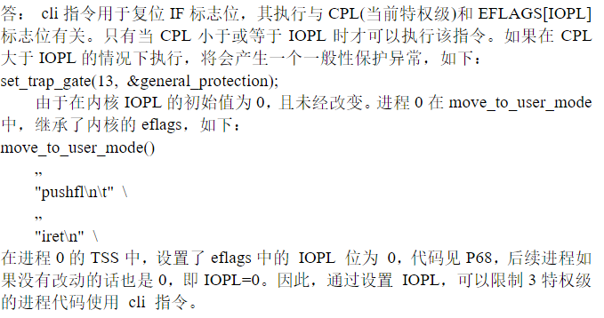

# 思考题2

1. **进程 0 的 `task_struct`、内核栈、用户栈在哪？证明进程 0 的用户栈就是未激活进程 0 时的 0 特权栈，即 `user_stack`，而进程 0 的内核栈并不是 `user_stack`，给出代码证据。**

   > 1. `task_struct` 位于全局静态变量 `init_task` 定义时的位置：
   >
   >    ```c
   >    static union task_union init_task = {INIT_TASK,};
   >    ```
   >
   > 2. 内核栈的栈底位于比 `task_struct` 地址高 4KB 的位置：
   >
   >    ```c
   >    union task_union {
   >    	struct task_struct task;	// 965B
   >    	char stack[PAGE_SIZE];		// 内核栈
   >    };
   >    ```
   >
   > 3. 用户栈位于全局变量 `user_stack` 定义的位置：
   >
   >    ```c
   >    long user_stack [ PAGE_SIZE>>2 ] ;
   >    ```
   >
   > 4. 在 `head.s` 中，定义 0 特权级的栈为 `stack_start`：
   >
   >    ```asm
   >    lss _stack_start,%esp
   >    ```
   >
   >    `stack_start` 定义如下：
   >
   >    ```c
   >    struct {
   >    	long * a;
   >    	short b;
   >    	} stack_start = { & user_stack [PAGE_SIZE>>2] , 0x10 };
   >    ```
   >
   >    因此 0 特权级的栈就是 `user_stack`，并且段选择子为 0x10，指向 GDT 表中的第 2 项，即内核数据段描述符，在 `head.s` 中定义如下：
   >
   >    ```asm
   >    .quad 0x00c0920000000fff
   >    ```
   >
   >    基址为 0x00000000，段界限为 16MB。
   >
   >    进程 0 进入用户态使用的 `ss` 为 0x17：
   >
   >    ```c
   >    #define move_to_user_mode() \
   >    __asm__ ("movl %%esp,%%eax\n\t" \
   >    	"pushl $0x17\n\t" /* ss  10111(ldt) */\
   >    	"pushl %%eax\n\t" /* esp user_stack 用户态也用这个栈 */\
   >    	"pushfl\n\t" /* eflags */\
   >    	"pushl $0x0f\n\t" /* cs 1111(ldt) */\
   >    	"pushl $1f\n\t" /* eip 以上手动压中断栈*/\
   >    	"iret\n" /* 从 0 特权跳转到 3 特权 */\
   >    	"1:\tmovl $0x17,%%eax\n\t" \
   >    	"movw %%ax,%%ds\n\t" \
   >    	"movw %%ax,%%es\n\t" \
   >    	"movw %%ax,%%fs\n\t" \
   >    	"movw %%ax,%%gs" \
   >    	:::"ax")
   >    ```
   >
   >    指向进程 0 LDT 表中的第 2 项，即用户数据段描述符，在 `sched.h` 的 `INIT_TASK` 宏中定义如下：
   >
   >    ```c
   >    {0x9f,0xc0f200}
   >    ```
   >
   >    基址为 0x00000000，段界限为 640KB，与进程 0 在 0 特权级下使用的栈段在 640KB 以内重合。同时进程 0 进入用户态使用的是内核态的栈顶指针偏移量 `esp`，由于基址相同，因此进程 0 进入用户态后 `esp` 指向的地址不变，还是 `user_stack` 表示的栈。
   >
   > 5. 进程 0 的内核栈定义在进程 0 `task_struct` 中的 `tss` 中，在 `INIT_TASK` 中定义如下：
   >
   >    ```c
   >    /*tss*/	{0,PAGE_SIZE+(long)&init_task,0x10,0,0,0,0,(long)&pg_dir,\
   >    	 0,0,0,0,0,0,0,0, \
   >    	 0,0,0x17,0x17,0x17,0x17,0x17,0x17, \
   >    	 _LDT(0),0x80000000, \
   >    		{} \
   >    	}, \
   >    ```
   >
   >    根据 `tss_struct` 结构体，`tss.esp0 = PAGE_SIZE+(long)&init_task`，`tss.ss0 = 0x10`，因此并不是 `user_stack`。

2. **在 `system.h` 里**

   ```c
   #define _set_gate(gate_addr,type,dpl,addr) \
   __asm__ ("movw %%dx,%%ax\n\t" \
       "movw %0,%%dx\n\t" \
       "movl %%eax,%1\n\t" \
       "movl %%edx,%2" \
       : \
       : "i" ((short) (0x8000+(dpl<<13)+(type<<8))), \
       "o" (*((char *) (gate_addr))), \
       "o" (*(4+(char *) (gate_addr))), \
       "d" ((char *) (addr)),"a" (0x00080000))
   
   #define set_intr_gate(n,addr) \
       _set_gate(&idt[n],14,0,addr)
   #define set_trap_gate(n,addr) \
       _set_gate(&idt[n],15,0,addr)
   #define set_system_gate(n,addr) \
       _set_gate(&idt[n],15,3,addr)
   ```

   **这里中断门、陷阱门、系统调用都是通过 `_set_gate` 设置的，用的是同一个嵌入汇编代码，比较明显的差别是 `dpl` 一个是 3，另外两个是 0，这是为什么？说明理由。**

   > 1. 门的特权检验规则为：CPL <= 调用门 DPL；RPL <= 调用门DPL
   > 2. 系统调用是由用户态程序调用的，因此 DPL 为 3.
   > 3. 以 `int` 指令主动发中断时使用中断门，以 `int3` 指令主动发中断时使用陷阱门，中断门和陷阱门不能被用户态程序调用，因此 DPL 为 0.

3. **进程 0 `fork` 进程 1 之前，为什么先要调用 `move_to_user_mode()`？用的是什么方法？解释其中的道理。**

   > 1. 使其进入用户态。`fork` 为系统调用，需要在用户态下调用。Linux 规定，除进程 0 之外，所有进程都是由一个已有进程在用户态下完成创建的。
   > 3. 使用 `iret` 指令进入用户态，因为从内核态跳转到用户态只能使用 `iret` 指令，`iret` 为中断返回指令，执行该指令硬件会自动将 `eip`、`cs` 和 `eflags` 弹栈，如果需要切换特权级，还需要将 `esp`、`ss` 弹栈。因此在执行 `iret` 指令前需要将栈构造好，`ss` 和 `esp` 为进程 0 的用户栈段选择子和栈顶指针 `user_stack`，`cs` 和 `eip` 为进程 0 的用户代码段选择子和指令指针，指令指针指向从 `iret` 返回的下一条指令的地址。`cs` 和 `ss` 为进程 0  `ldt` 的选择子。
   
4. **在 IA-32 中，有大约 20 多个指令是只能在 0 特权级下使用，其他的指令，比如 `cli`，并没有这个约定。奇怪的是，在 Linux0.11 中，在 3 特权级的进程代码并不能使用 `cli` 指令，会报特权级错误，这是为什么？请解释并给出代码证据。**

   > 
   >
   > ```c
   > #define INIT_TASK \
   > /* ... */\
   > /*tss*/	{0,PAGE_SIZE+(long)&init_task,0x10,0,0,0,0,(long)&pg_dir,\
   > 	 0,0,0,0,0,0,0,0, /* eflags 的值为 0 */\
   > 	 0,0,0x17,0x17,0x17,0x17,0x17,0x17, \
   > 	 _LDT(0),0x80000000, \
   > 		{} \
   > 	}, \
   > }
   > ```
   >
   > 在 3 特权级下执行 `cli` 指令会触发一般保护异常，中断号为 0x0d：
   >
   > ```asm
   > _general_protection:
   > 	pushl $_do_general_protection
   >  	jmp error_code
   > 
   > error_code:
   > 	// ...
   > 	iret
   > ```
   >
   > ```c
   > set_trap_gate(13,&general_protection);
   >      
   > void do_general_protection(long esp, long error_code)
   > {
   > 	die("general protection",esp,error_code);
   > }
   > ```
   >
   > 实验：
   >
   > 修改 `init/main.c` 中的代码为：
   >
   > ```c
   > 	move_to_user_mode();
   > 	__asm__ ("cli"::);
   > 	if (!fork()) {		/* we count on this going ok */
   > 		init();
   > 	}
   > ```
   >
   > 结果：
   >
   > 

5. **用户进程自己设计一套 LDT 表，并与 GDT 挂接，是否可行，为什么？**

   > 不可行。
   >
   > 1. 用户态无法访问 gdtr 的值，因此无法访问 GDT；
   > 2. GDT 位于内核数据段，属于 0 特权级，3 特权级的用户进程无权访问修改；
   > 3. LDT 的首地址的值必须使用 `lldt` 指令挂载到 ldtr 上才能被使用，但 `lldt` 指令是特权指令。

6. **分析初始化 IDT、GDT、LDT 的代码。**

   > 1. 初始化 IDT 的代码：
   >
   > ```gas
   > setup_idt:
   > 	lea ignore_int,%edx		# edx 保存中断描述符的高 32 位
   > 	movl $0x00080000,%eax	# eax 保存中断描述符的低 32 位
   > 	movw %dx,%ax		/* selector = 0x0008 = cs */
   > 	movw $0x8E00,%dx	/* interrupt gate - dpl=0, present */
   > 	# 以上构造中断描述符
   > 	lea _idt,%edi		# IDT 的基址
   > 	mov $256,%ecx
   > rp_sidt:
   > 	movl %eax,(%edi)
   > 	movl %edx,4(%edi)	# 填充 IDT 的内容
   > 	addl $8,%edi
   > 	dec %ecx
   > 	jne rp_sidt
   > 	lidt idt_descr		# 为 idtr 赋值
   > 	ret
   > 	
   > int_msg:
   > 	.asciz "Unknown interrupt\n\r"
   > .align 2
   > ignore_int:				# 默认中断处理程序
   > 	pushl %eax
   > 	pushl %ecx
   > 	pushl %edx
   > 	push %ds
   > 	push %es
   > 	push %fs
   > 	movl $0x10,%eax
   > 	mov %ax,%ds
   > 	mov %ax,%es
   > 	mov %ax,%fs
   > 	pushl $int_msg
   > 	call _printk		# 输出 "Unknown interrupt"
   > 	popl %eax
   > 	pop %fs
   > 	pop %es
   > 	pop %ds
   > 	popl %edx
   > 	popl %ecx
   > 	popl %eax
   > 	iret
   > 	
   > idt_descr:
   > 	.word 256*8-1		# idt contains 256 entries，IDT 的占用空间
   > 	.long _idt			# IDT 的基址
   > 
   > # IDT 的数据
   > _idt:	.fill 256,8,0		# idt is uninitialized
   > ```
   >
   > ```c
   > void trap_init(void)
   > {
   > 	int i;
   > 
   > 	set_trap_gate(0,&divide_error);		// 设置除操作出错的中断向量值，以下相同
   > 	set_trap_gate(1,&debug);
   > 	set_trap_gate(2,&nmi);
   > 	set_system_gate(3,&int3);	/* int3-5 can be called from all */
   > 	set_system_gate(4,&overflow);
   > 	set_system_gate(5,&bounds);
   > 	set_trap_gate(6,&invalid_op);
   > 	set_trap_gate(7,&device_not_available);
   > 	set_trap_gate(8,&double_fault);
   > 	set_trap_gate(9,&coprocessor_segment_overrun);
   > 	set_trap_gate(10,&invalid_TSS);
   > 	set_trap_gate(11,&segment_not_present);
   > 	set_trap_gate(12,&stack_segment);
   > 	set_trap_gate(13,&general_protection);
   > 	set_trap_gate(14,&page_fault);
   > 	set_trap_gate(15,&reserved);
   > 	set_trap_gate(16,&coprocessor_error);
   > 	for (i=17;i<48;i++)
   > 		set_trap_gate(i,&reserved);		// 保留
   > 	set_trap_gate(45,&irq13);		// 设置协处理器中断 0x2d(45) 陷阱门描述符，并允许其产生中断请求。设置并行口中断描述符
   > 	outb_p(inb_p(0x21)&0xfb,0x21);		// 允许 8259A 主芯片的 IRQ2 中断请求
   > 	outb(inb_p(0xA1)&0xdf,0xA1);		// 允许 8259A 主芯片的 IRQ13 中断请求
   > 	set_trap_gate(39,&parallel_interrupt);	// 设置并行口 1 的中断 0x27 陷阱门描述符
   > }
   > 
   > #define set_trap_gate(n,addr) \
   > 	_set_gate(&idt[n],15,0,addr)
   > 
   > #define _set_gate(gate_addr,type,dpl,addr) \
   > __asm__ ("movw %%dx,%%ax\n\t" \
   > 	"movw %0,%%dx\n\t" \
   > 	"movl %%eax,%1\n\t" /* 中断描述符的低 32 位 */\
   > 	"movl %%edx,%2" /* 中断描述符的高 32 位 */\
   > 	: \
   > 	: "i" ((short) (0x8000+(dpl<<13)+(type<<8))), /* bit32~bit47 */\
   > 	"o" (*((char *) (gate_addr))), \
   > 	"o" (*(4+(char *) (gate_addr))), \
   > 	"d" ((char *) (addr)),"a" (0x00080000))
   > ```
   >
   > 2. 初始化 GDT 的代码：
   >
   > ```asm
   > setup_gdt:
   > 	lgdt gdt_descr		# 为 gdtr 赋值
   > 	ret
   > 	
   > gdt_descr:
   > 	.word 256*8-1		# GDT 的占用空间
   > 	.long _gdt		# GDT 的基址
   > 	
   > # GDT 的数据
   > _gdt:	.quad 0x0000000000000000	/* NULL descriptor */
   > 	.quad 0x00c09a0000000fff	/* 内核代码段描述符 base=0 limit=16MB 可读 非一致性代码段 */
   > 	.quad 0x00c0920000000fff	/* 内核数据段描述符 base=0 limit=16MB 可写 */
   > 	.quad 0x0000000000000000	/* TEMPORARY - don't use */
   > 	.fill 252,8,0			/* space for LDT's and TSS's etc */
   > ```
   >
   > 3. 初始化 LDT 的代码：
   >
   > ```c
   > #define INIT_TASK \
   > /* ... */\
   > 	{ \
   > 		{0,0}, \
   > /* ldt */	{0x9f,0xc0fa00}, /* 用户态代码段 base=0 limit=640KB 可读 非一致性代码段 */\
   > 		{0x9f,0xc0f200}, /* 用户态数据段 base=0 limit=640KB 可写 */\
   > 	}, \
   > /* ... */\
   > }
   > 
   > // 在 GDT 中挂载 LDT 的描述符
   > #define set_ldt_desc(n,addr) _set_tssldt_desc(((char *) (n)),addr,"0x82")
   > 
   > #define _set_tssldt_desc(n,addr,type) \
   > __asm__ ("movw $104,%1\n\t" /* bit0~bit15 */\
   > 	"movw %%ax,%2\n\t" /* bit16~bit31 */\
   > 	"rorl $16,%%eax\n\t" /* 循环右移 */\
   > 	"movb %%al,%3\n\t" /* bit32~bit39 */\
   > 	"movb $" type ",%4\n\t" /* bit40~bit47 */\
   > 	"movb $0x00,%5\n\t" /* bit48~bit55 */\
   > 	"movb %%ah,%6\n\t" /* bit56~bit63 */\
   > 	"rorl $16,%%eax" \
   > 	::"a" (addr), "m" (*(n)), "m" (*(n+2)), "m" (*(n+4)), \
   > 	 "m" (*(n+5)), "m" (*(n+6)), "m" (*(n+7)) \
   > 	)
   > ```
   >

7. **在 `sched_init(void)` 函数中有这样的代码：**

   ```c
   for(i=1;i<NR_TASKS;i++) {
       task[i] = NULL;
       ……
   ```

   **但并未涉及task[0]，从后续代码能感觉到已经给了进程0，请给出代码证据。**

   > `task` 数组在定义时就已经初始化了 `task[0]`：
   >
   > ```c
   > struct task_struct * task[NR_TASKS] = {&(init_task.task), };
   > ```