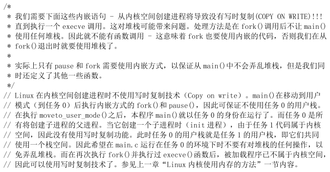

# 思考题3

1. **进程 0 `fork` 进程 1 之前，为什么先调用 `move_to_user_mode()`？用的是什么方法？解释其中的道理。**

2. **为什么 `static inline _syscall0(type,name)` 中加上关键字 inline？**

   > 
   >
   > 1. `fork` 之后内核会通过将子进程放在队列的前面，以让子进程先执行，以免父进程执行导致写时复制，而后子进程执行 `exec` 系统调用，因无意义的复制而造成效率的下降。
   >
   > 2. 每个进程都有自己的内核空间，不会造成 COW，而在 `fork.c` 中调用 `copy_page_tables` 只是对用户数据段进行复制，因此主要就是防止进程 0 使用用户数据段造成 COW。
   >
   >    ```c
   >    int copy_mem(int nr,struct task_struct * p)		// 做线性和物理内存
   >    {
   >    	// ...
   >    	old_data_base = get_base(current->ldt[2]);
   >    	// ...
   >    	new_data_base = new_code_base = nr * 0x4000000;		// nr * 64MB(4GB / 64)
   >    	// ...
   >    	if (copy_page_tables(old_data_base,new_data_base,data_limit)) {		// 为子进程复制父进程页表内容
   >    		free_page_tables(new_data_base,data_limit);
   >    		return -ENOMEM;
   >    	}
   >    	return 0;
   >    }
   >    ```

3. **`copy_process` 函数的参数最后五项是：`long eip,long cs,long eflags,long esp,long ss`。查看栈结构确实有这五个参数，奇怪的是其他参数的压栈代码都能找得到，却找不到这五个参数的压栈代码，反汇编代码中也查不到，请解释原因。**

   > `copy_process` 函数是由系统调用来调用的，系统调用是用 `int 0x80` 中断实现的，当发生中断时，如果需要进行特权级转换，则硬件自动将 `ss` 和 `esp` 压栈，然后将 `eflags`、`cs` 和 `eip` 压栈。

4. **打开保护模式、分页后，线性地址到物理地址是如何转换的？**

   > 1. cpu 通过 cr3 寄存器定位到页目录表的物理地址；
   > 2. 使用线性地址的高 10 位作为索引在页目录表中定位到某一页目录表项；
   > 3. 读出页目录表项的内容，即为页表的物理地址；
   > 4. 使用线性地址的中间 10 位作为索引在页表中定位到某一页表项；
   > 5. 读出页表项的内容，即为对应的页的起始物理地址；
   > 6. 页的起始物理地址加上线性地址的低 12 位即为线性地址对应的物理地址。
   >
   > 

5. **分析 `get_free_page()` 函数的代码，叙述在主内存中获取一个空闲页的技术路线。**

   > 在 `mem_map` 中从后向前找出引用计数为 0 的第一项，将该项的引用计数置为 1，并通过下标计算空闲页的起始物理地址(`LOW_MEM+(index<<12)`)，从高地址向低地址用 0 填充该页，最后返回该页的起始物理地址。如果所有的引用计数都不为 0，即没有空闲页，则返回 0.

6. **分析 `copy_page_tables()` 函数的代码，叙述父进程如何为子进程复制页表。**

   > 1. 要求源地址和目的地址必须按 4MB 对齐；
   > 2. 计算源地址和目的地址所在的页目录表项的线性地址；
   > 3. 通过所占的地址空间计算所用的页目录表项数；
   > 4. 根据页目录表项的起始线性地址和页目录表项数遍历页目录表，对每一个源页目录表项，如果对应的页表存在，则进行以下操作：
   >    1. 从页目录表项中取出对应的页表的起始物理地址；
   >    2. 为目的页表分配一个空白页，并挂到目的页目录表项上，并将标志设置为用户级的、可读写、存在；
   >    3. 计算需要复制的页表项数，如果是内核空间(源地址为 0)，则只复制前 160 项(内核空间只占低 640 KB)，否则全部复制。
   >    4. 遍历页表，对于每一个源页表项，如果对应的页存在，则进行以下操作：
   >       1. 从源页表中复制每一项到目的页表，同时置为"只读"，以便进行 COW；
   >       2. 如果页表项对应的页的地址在 1MB 以上(非内核页面)，则将源页表项置为"只读"，并在 `mem_map` 中将该页的引用计数加 1；
   > 5. 重新加载 cr3，刷新 TLB。

7. **进程 0 创建进程 1 时，为进程 1 建立了 `task_struct` 及内核栈，第一个页表，分别位于物理内存 16MB 顶端倒数第一页、第二页。请问，这两个页究竟占用的是谁的线性地址空间，内核、进程 0、进程 1、还是没有占用任何线性地址空间？说明理由（可以图示）并给出代码证据。**

   > 占用的是内核的线性地址空间，也即为进程 0、进程 1 位于内核态下的线性地址空间。
   >
   > 在 `head.s` 中，`setup_paging` 函数对内核进行分页，令内核线性地址等于物理地址：
   >
   > ```asm
   > setup_paging:	// 内核分页，分完以后 线性地址 == 物理地址
   > 	// ...
   > 	movl $pg3+4092,%edi
   > 	movl $0xfff007,%eax		/*  16Mb - 4096 + 7 (r/w user,p) */		// 页表中最后一项对应的地址(一页的起始地址)		线性地址 == 物理地址
   > 	std		// 方向：edi 递减
   > 1:	stosl			/* fill pages backwards - more efficient :-) */		// 注意：没有 rep，说明是一项一项地填的
   > 	subl $0x1000,%eax	// 页表每一项对应一页(0x1000 == 4096)
   > 	jge 1b
   > 	// ...
   > ```
   >
   > 由于 `get_free_page()` 分配的是物理地址，因此占用的是内核的线性地址空间。
   >
   > 进程 0 用户态的线性地址空间是内存前 640KB，因此无法访问到 16MB 的顶端倒数的两个页，所以占用的不是进程 0 用户态的线性地址空间。
   >
   > 进程 1 拷贝了进程 0 的页表以及 ldt，并修改了 ldt 内描述符的段基址，因此线性空间也被限制在了 640KB 内，同时进程 1 用户态的线性地址不等于物理地址，所以占用的不是进程 1 的线性地址空间。
   >
   > ```c
   > int copy_mem(int nr,struct task_struct * p)		// 做线性和物理内存
   > {
   > 	// ...
   > 	new_data_base = new_code_base = nr * 0x4000000;		// nr * 64MB(4GB / 64)
   > 	p->start_code = new_code_base;
   > 	set_base(p->ldt[1],new_code_base);		// 做子进程的 ldt
   > 	set_base(p->ldt[2],new_data_base);		// 以上为子进程做线性地址空间
   > 	// ...
   > }
   > ```
   
8. **根据代码详细分析，进程 0 如何根据调度第一次切换到进程 1 的。**

   > 1. 进程 0 通过 `fork` 函数创建完进程 1 后执行 `pause` 函数；
   >
   >    ```c
   >    	if (!fork()) {		/* we count on this going ok */
   >    		init();		// 进程 1
   >    	}
   >    
   >    	for(;;) pause();	// 进程 0
   >    ```
   >
   > 2. `pause` 函数是一个系统调用，系统调用执行 `sys_pause` 函数；
   >
   >    ```c
   >    #define _syscall0(type,name) \
   >    type name(void) \
   >    { \
   >    long __res; \
   >    __asm__ volatile ("int $0x80" \
   >    	: "=a" (__res) \
   >    	: "0" (__NR_##name)); \
   >    if (__res >= 0) \
   >    	return (type) __res; \
   >    errno = -__res; \
   >    return -1; \
   >    }
   >    ```
   >
   >    ```asm
   >    _system_call:
   >    	# ...
   >    	call _sys_call_table(,%eax,4)
   >    	# ...
   >    	
   >    #define __NR_pause	29
   >    ```
   >
   > 3. `sys_pause` 函数将进程 0 挂起，调用 `schedule` 函数进行调度；
   >
   >    ```c
   >    int sys_pause(void)
   >    {
   >    	current->state = TASK_INTERRUPTIBLE;	// 挂起
   >    	schedule();
   >    	return 0;
   >    }
   >    ```
   >
   > 4. `schedule` 函数获取进程 1 在 `task` 数组中的下标，调用 `switch_to` 函数进行切换；
   >
   >    ```c
   >    void schedule(void)
   >    {
   >    	int i,next,c;
   >    	struct task_struct ** p;
   >    
   >    /* check alarm, wake up any interruptible tasks that have got a signal */
   >    	// ...
   >    
   >    /* this is the scheduler proper: */
   >    
   >    	while (1) {
   >    		c = -1;
   >    		next = 0;
   >    		i = NR_TASKS;
   >    		p = &task[NR_TASKS];
   >    		while (--i) {
   >    			if (!*--p)
   >    				continue;
   >    			if ((*p)->state == TASK_RUNNING && (*p)->counter > c)
   >    				c = (*p)->counter, next = i;
   >    		}	// 得到就绪态的并且时间片最多的，即进程 1
   >    		if (c) break;	// 进程 1 有时间片，直接退出
   >    		for(p = &LAST_TASK ; p > &FIRST_TASK ; --p)
   >    			if (*p)
   >    				(*p)->counter = ((*p)->counter >> 1) +
   >    						(*p)->priority;
   >    	}
   >    	switch_to(next);	// 实际切换
   >    }
   >    ```
   >
   > 5. 在 `switch_to` 中，先判断目标进程是否为当前进程，当前进程为进程 0，目标进程为进程 1，因此将进程 1 TSS 描述符的段选择子赋值到 `__tmp.b` 中，设置当前进程为进程 1，使用 `ljmp` 加上 TSS 描述符的选择子和偏移量就跳转到了进程 1 中。
   >
   >    ```c
   >    #define switch_to(n) {\
   >    struct {long a,b;} __tmp; /* 偏移量，段选择子(ljmp 的参数) */\
   >    __asm__("cmpl %%ecx,_current\n\t" \
   >    	"je 1f\n\t" \
   >    	"movw %%dx,%1\n\t" \
   >    	"xchgl %%ecx,_current\n\t" \
   >    	"ljmp %0\n\t" /* 分界 */\
   >    	"cmpl %%ecx,_last_task_used_math\n\t" \
   >    	"jne 1f\n\t" \
   >    	"clts\n" \
   >    	"1:" \
   >    	::"m" (*&__tmp.a),"m" (*&__tmp.b), \
   >    	"d" (_TSS(n)),"c" ((long) task[n])); /* 目标进程的 tss 的段选择子，目标进程的 task_struct 指针 */\
   >    }
   >    ```

9. **`switch_to(n)` 代码中的 `"ljmp %0\n\t"` 很奇怪，按理说 `jmp` 指令跳转到得位置应该是一条指令的地址，可是这行代码却跳到了 `"m" (*&__tmp.a)`，这明明是一个数据的地址，更奇怪的，这行代码竟然能正确执行。请论述其中的道理。**

   > `__tmp.a` 为偏移量，`__tmp.b` 为段选择子，通过 `movw %%dx,%1\n\t` 指令将目标进程 TSS 描述符的段选择子赋值到 `__tmp.b` 中，`ljmp` 加上 TSS 描述符的选择子和偏移量就跳转到了目标进程中，在这个过程中将 CPU 的各个寄存器值保存在进程 0 的 TSS 中，将进程 1 的 TSS 数据加载到 CPU 的各个寄存器中。

10. **进程 0 开始创建进程 1，调用 `fork()`，跟踪代码时我们发现，`fork` 代码执行了两次，第一次，执行 `fork` 代码后，跳过 `init()` 直接执行了 `for(;;) pause()`，第二次执行 `fork` 代码后，执行了 `init()`。奇怪的是，我们在代码中并没有看到向转向 `fork` 的 `goto` 语句，也没有看到循环语句，是什么原因导致 `fork` 反复执行？请说明理由（可以图示），并给出代码证据。**

    > 1. 进程 0 调用 `fork` 函数，`fork` 函数使用 `int 0x80` 系统调用，系统调用执行 `copy_process` 函数；
    >
    >    ```c
    >    static inline _syscall0(int,fork)
    >        
    >    #define _syscall0(type,name) \
    >    type name(void) \
    >    { \
    >    long __res; \
    >    __asm__ volatile ("int $0x80" \
    >    	: "=a" (__res) \
    >    	: "0" (__NR_##name)); \
    >    if (__res >= 0) \
    >    	return (type) __res; \
    >    errno = -__res; \
    >    return -1; \
    >    }
    >    ```
    >
    >    ```asm
    >    _system_call:
    >    	# ...
    >    	call _sys_call_table(,%eax,4)
    >    	# ...
    >    	
    >    #define __NR_fork	2
    >    	
    >    _sys_fork:
    >    	# ...
    >    	call _copy_process		# 父子进程创建机制
    >    	# ...
    >    ```
    >
    > 2. 进程 0 为进程 1 构造 `task_struct`，并执行 `p->tss.eip = eip;`、`p->tss.eax = 0;`，其中 `eip` 指向进程 0 调用中断的下一条指令的地址，即 `if (__res >= 0)`；
    >
    >    ```c
    >    int copy_process(int nr,long ebp,long edi,long esi,long gs,long none,	// nr 是进程号，none 是 call sys_fork 时压的返回地址
    >    		long ebx,long ecx,long edx,
    >    		long fs,long es,long ds,
    >    		long eip,long cs,long eflags,long esp,long ss)		// 中断自动压栈
    >    {
    >    	struct task_struct *p;
    >    	// ...
    >    	p = (struct task_struct *) get_free_page();
    >    	// ...
    >    	p->tss.eip = eip;	// 父进程进入中断前的下一条指令的地址
    >    	// ...
    >    	p->tss.eax = 0;		// 子进程 fork() 的返回值
    >    	// ...
    >    	return last_pid;
    >    }
    >    ```
    >
    > 3. 进程 0 从 `copy_process` 函数返回，返回值为 `last_pid`，即进程 1 的 `pid`，保存在 `eax` 寄存器中；
    >
    > 4. 进程 0 从中断返回，`eax` 寄存器的值为进程 1 的 `pid`，然后从 `fork` 函数返回，返回值 `eax` 不为 0，跳过 `init()` 直接执行了 `for(;;) pause()`；
    >
    > 5. 进程 0 在 `pause` 函数中被挂起， 由于只有进程 1 处于就绪态， 因此 cpu 调度到进程 1 执行，即将进程 1 `task_struct` 中的 `tss` 字段的内容加载到 cpu 中；
    >
    >    ```c
    >    static inline _syscall0(int,pause)
    >    
    >    int sys_pause(void)
    >    {
    >    	current->state = TASK_INTERRUPTIBLE;	// 挂起
    >    	schedule();
    >    	return 0;
    >    }
    >    
    >    void schedule(void)
    >    {
    >    	// ...
    >    	switch_to(next);	// 实际切换
    >    }
    >    
    >    #define switch_to(n) {\
    >    struct {long a,b;} __tmp; /* 偏移量，段选择子(ljmp 的参数) */\
    >    __asm__("cmpl %%ecx,_current\n\t" \
    >    	"je 1f\n\t" \
    >    	"movw %%dx,%1\n\t" \
    >    	"xchgl %%ecx,_current\n\t" \
    >    	"ljmp %0\n\t" /* 分界 */\
    >    	"cmpl %%ecx,_last_task_used_math\n\t" \
    >    	"jne 1f\n\t" \
    >    	"clts\n" \
    >    	"1:" \
    >    	::"m" (*&__tmp.a),"m" (*&__tmp.b), \
    >    	"d" (_TSS(n)),"c" ((long) task[n])); /* 目标进程的 tss 的段选择子，目标进程的 task_struct 指针 */\
    >    }
    >    ```
    >
    > 6. cpu 中的 `eip` 为 `if (__res >= 0)` 的地址，`eax` 为 0，开始执行，从 `fork` 函数返回，返回值 `eax` 为 0，执行 `init()`。

11. **详细分析进程调度的全过程。考虑所有可能（signal、alarm 除外）**

    > ```c
    > void schedule(void)
    > {
    > 	int i,next,c;
    > 	struct task_struct ** p;
    > 
    > /* check alarm, wake up any interruptible tasks that have got a signal */
    > 	// ...
    > 
    > /* this is the scheduler proper: */
    > 
    > 	while (1) {
    > 		c = -1;
    > 		next = 0;
    > 		i = NR_TASKS;
    > 		p = &task[NR_TASKS];
    > 		while (--i) {
    > 			if (!*--p)
    > 				continue;
    > 			if ((*p)->state == TASK_RUNNING && (*p)->counter > c)
    > 				c = (*p)->counter, next = i;
    > 		}	// 得到就绪态的并且时间片最多的，即进程 1
    > 		if (c) break;	// 进程 1 有时间片，直接退出
    > 		for(p = &LAST_TASK ; p > &FIRST_TASK ; --p)
    > 			if (*p)
    > 				(*p)->counter = ((*p)->counter >> 1) +
    > 						(*p)->priority;
    > 	}
    > 	switch_to(next);	// 实际切换
    > }
    > ```
    >
    > 
    >
    > ```c
    > #define switch_to(n) {\
    > struct {long a,b;} __tmp; /* 偏移量，段选择子(ljmp 的参数) */\
    > __asm__("cmpl %%ecx,_current\n\t" \
    > 	"je 1f\n\t" \
    > 	"movw %%dx,%1\n\t" \
    > 	"xchgl %%ecx,_current\n\t" \
    > 	"ljmp %0\n\t" /* 分界 */\
    > 	"cmpl %%ecx,_last_task_used_math\n\t" \
    > 	"jne 1f\n\t" \
    > 	"clts\n" \
    > 	"1:" \
    > 	::"m" (*&__tmp.a),"m" (*&__tmp.b), \
    > 	"d" (_TSS(n)),"c" ((long) task[n])); /* 目标进程的 tss 的段选择子，目标进程的 task_struct 指针 */\
    > }
    > ```
    >
    > 1. 在 `switch_to` 中，先判断目标进程是否为当前进程，若是，则直接返回，否则将目标进程 TSS 描述符的段选择子赋值到 `__tmp.b` 中，设置当前进程为目标进程，使用 `ljmp` 加上 TSS 描述符的选择子和偏移量就跳转到了目标进程中。
    > 2. 当目标进程被调度回来后，判断上个进程是否使用过协处理器，没有则跳转退出，否则清 cr0 中的任务切换。